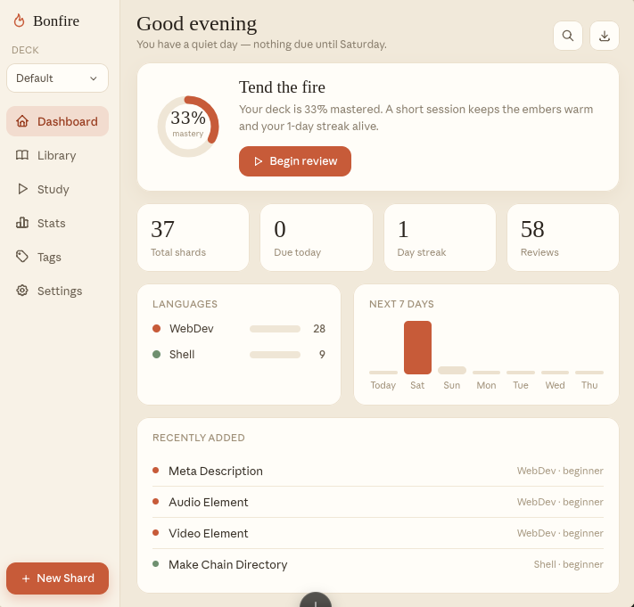

# Hearth

An active-recall study tool for code and developer syntax, scheduled with
[FSRS](https://github.com/open-spaced-repetition/free-spaced-repetition-scheduler)
or SM-2.

Hearth is not passive flashcards. A card shows you a question, you **type the
answer into a blank editor**, submit, and then see your answer side by side with
the stored one and grade yourself. It has decks, cloze and reverse cards, image
and audio attachments, tag management, a study heatmap with retention
projections, and Playbooks — ordered walkthroughs you write over your own cards.

Your cards can sync across every machine you study on, through a private git
repository you own. See [Sync](#sync) below.



---

## Requirements

Hearth is a [Tauri](https://tauri.app) app, so it builds from source. The
installer handles the system packages for you — you only need a supported
distribution and `sudo`.

| | Debian / Ubuntu / Pop!_OS / Mint | Arch / Manjaro / EndeavourOS |
|---|---|---|
| Detected as | `debian` | `arch` |
| Installed by the script | `libwebkit2gtk-4.1-dev`, `libgtk-3-dev`, `librsvg2-dev`, `patchelf`, `libayatana-appindicator3-dev`, `build-essential`, `curl`, `wget`, `file`, `git` | `webkit2gtk-4.1`, `base-devel`, `openssl`, `appmenu-gtk-module`, `libappindicator-gtk3`, `librsvg`, `curl`, `wget`, `file`, `git` |

You also need **Node 18+** and **Rust**. The installer checks for both and
installs Rust via `rustup` if it is missing; Node you install yourself
(`apt install nodejs npm`, `pacman -S nodejs npm`, or nvm).

On any other distribution the installer stops and tells you which equivalents to
install — see the [Tauri prerequisites](https://tauri.app/start/prerequisites/).
Once they are present, re-run and it continues.

---

## Install

```bash
git clone https://github.com/sundoesdev/Bonfire.git hearth
cd hearth
./install.sh
```

That builds Hearth (a few minutes the first time), installs it to
`~/.local/bin/hearth`, and adds it to your application launcher. At the end it
offers to set up sync — you can skip that and do it later.

Hearth is fully usable with no sync configured. Everything lives in a local
SQLite database at `~/.local/share/com.bonfire.app/vault.db`.

---

## Sync

Hearth keeps your cards, schedules, and review history identical on every
machine through **a private git repository that you own**. There is no server to
run and no account to make, and because it shells out to the `git` already on
your machine, your existing SSH key or credential helper does the
authentication — **Hearth never sees or stores a password or token.**

### Set it up

1. **Create an empty private repository.** On GitHub (or GitLab, or a bare repo
   over SSH), make a new private repo — call it something like `hearth-vault`.
   Do not add a README; Hearth wants it empty.

   > **Your vault is not a fork of Hearth.** Your cards and Hearth's source code
   > are two separate repositories. Forking Hearth is only for contributing code.
   > If your cards lived in a fork, every study session would dirty your working
   > tree and pulling app updates would collide with your data.

2. **Point Hearth at it** — either at the `install.sh` prompt, or afterwards in
   **Settings → Sync** by pasting the URL and clicking Connect.

3. **On your second machine**, install Hearth the same way and give it the
   **same** repository URL. Its vault starts empty and the first sync pulls
   everything down.

That is the whole setup. Study on the laptop, close it, open the desktop, and
your due cards and streak are already there.

### When it syncs

Automatically on launch, when a study session starts, and when a session ends —
whether you finished the queue or quit early. There is also a **Sync now** button
in Settings, and an optional "sync after every card" toggle (off by default;
every rating is already saved to disk immediately, so it adds a network
round-trip without adding safety).

Syncing at both ends of every session is what keeps conflicts from happening at
all: the only way to create one is to study the same card on two machines during
*overlapping* sessions.

### If two machines do edit the same card

The newer edit wins, and the version that lost is kept and listed in
**Settings → Sync → Conflicts**, where you can view it, restore it, or dismiss
it. Nothing is ever silently discarded. Review history is always merged, never
overwritten — a review recorded on either machine survives.

Deletes propagate properly, too: a card deleted on one machine stays deleted,
rather than reappearing from the other.

The full merge rules, the on-disk vault format, and the edge cases are in
[docs/SYNC.md](docs/SYNC.md).

---

## Updating

```bash
git pull
./install.sh
```

Re-running the installer rebuilds and reinstalls, and **leaves your vault
completely alone**. If you ever want a clean slate — a blank local vault, with
your remote as the source of truth — use `./install.sh --fresh`. That refuses to
run if anything is unsynced, and takes a backup copy first regardless.

---

## Uninstall

```bash
./uninstall.sh
```

Removes exactly what the installer created, tracked in a manifest, then deletes
your local study data **only once it has confirmed everything is published to
your vault remote**. If anything is unsynced it refuses and shows you what, so
you can sync first.

Your remote is never touched, so reinstalling and reconnecting puts you back
exactly where you left off. This source checkout is never touched either — delete
it yourself if you want it gone.

```bash
./uninstall.sh --keep-data   # remove the app, keep your cards on this machine
./uninstall.sh --force       # delete data even if unsynced (not recoverable)
```

---

## Troubleshooting

**"git is not installed or not on PATH."** Sync shells out to `git`. Install it
(`apt install git` / `pacman -S git`) and reopen Hearth.

**Sync fails with `Author identity unknown` or similar.** `git` cannot commit
without a name and email. Hearth sets a repo-local fallback so this should not
happen, but you can set your own globally:

```bash
git config --global user.name "Your Name"
git config --global user.email "you@example.com"
```

**"No vault remote configured."** Sync is off until you add one in
Settings → Sync. This is not an error — Hearth works fine without it.

**Nothing arrives on the second machine.** Check both are pointed at the *same*
URL in Settings → Sync, and that the first machine has actually synced at least
once (its "Last synced" line should show a time). A brand-new empty repo is
correct — Hearth publishes to it on the first sync.

**The build fails on WebKitGTK.** Your distribution's `webkit2gtk` package is
missing or is the 4.0 series rather than 4.1. Install the 4.1 development
package for your distro and re-run `./install.sh`.

**`hearth: command not found` after installing.** `~/.local/bin` is not on your
`PATH`. Launch it from your application menu, or add that directory to `PATH`.

---

## Developing

All commands run from the `Bonfire/` subdirectory (the Tauri project is nested
one level down; the repository root holds the scripts and docs).

```bash
cd Bonfire
npm install
npm run tauri dev     # run with hot-reloaded frontend
npm run tauri build   # production build
```

The frontend is **vanilla JavaScript with no bundler** — ES modules served
straight off disk, with `highlight.js`, CodeMirror 5, and Cytoscape vendored
under `src/vendor/`. The Rust backend is in `Bonfire/src-tauri/`:

```bash
cd Bonfire/src-tauri
cargo check
cargo clippy
cargo test            # schedulers, vault format, merge rules, git transport
```

Architecture notes live in [docs/SYNC.md](docs/SYNC.md) (data model and sync) and
[docs/WEBAPP.md](docs/WEBAPP.md) (how a browser version would fit in).

---

## License

MIT — see [LICENSE](LICENSE).
